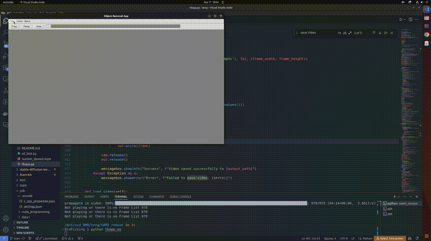

# SAM2 TKinter Gui

## Overview

The **SAM2 TKinter Gui** is a Python-based application designed for video processing using the SAM2 (Segment-Anything Model 2) model. The application provides functionality for inpainting videos by removing objects, setting mask colors, and applying diffusion-based inpainting techniques. The app features a user-friendly graphical interface built with Tkinter.

## Features

- **Video Playback Controls**: Play, pause, and stop video playback with a progress slider.
- **Frame Annotation**: Add positive or negative prompts to frames by clicking on the image.
- **Object Removal**: Remove objects from videos using color-based or diffusion-based inpainting.
- **Mask Management**: Save segmentation masks.
- **Video Saving**: Save the processed video with inpainted frames.
- **Configuration**: Customize inpainting settings through the GUI.

## Requirements

- Python >= 3.10
- Required Python libraries:
  - `yaml`
  - `cv2` (OpenCV)
  - `numpy`
  - `tkinter`
  - `torch`
  - `PIL` (Pillow)
  - `diffusers`
  - `tqdm`
  - `Segment-Anything 2 [1]`
  - `Simple-Lama-Inpainting [3]` 
 
  
## Usage
Modify config.yaml and change the checkpoint path, then run
```shell
python tkapp.py
```
You can load a video or a folder containing all the frame images of the video. Use left-click to add a positive point prompt and right-click to add a negative prompt. Run "Process" so that SAM2 can generate the masks for the chosen object. Use either color inpainting, LAMA, or stable-diffusion inpainting to inpaint the video.


## Example

### Background removements


### Object removements using LAMA


## Reference
1. Segment-Anything 2: [https://github.com/facebookresearch/segment-anything-2](https://github.com/facebookresearch/segment-anything-2)
2. LAMA: [https://github.com/advimman/lama](https://github.com/advimman/lama)
3. Simple-LAMA-inpainting: [https://github.com/enesmsahin/simple-lama-inpainting](https://github.com/enesmsahin/simple-lama-inpainting) 

